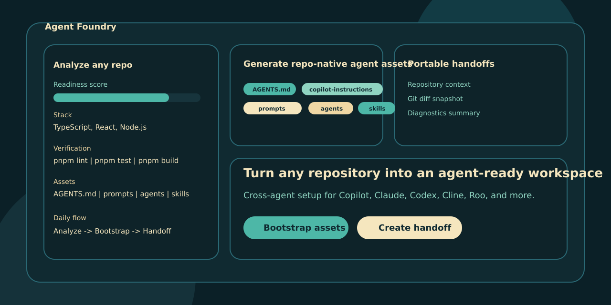
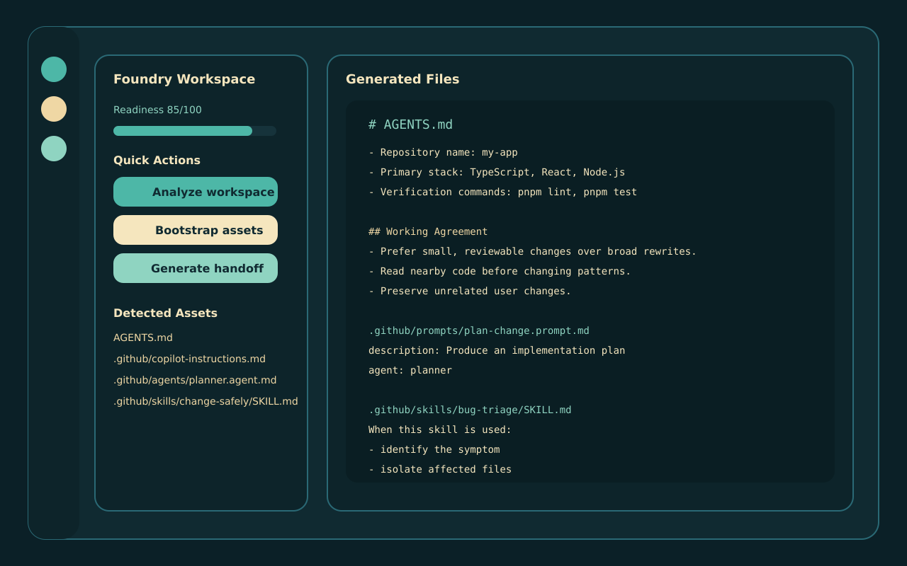

# Agent Foundry

`Agent Foundry` is a VS Code extension for the current agentic-software-engineering wave: instead of trying to be yet another coding agent, it turns any repository into an agent-ready workspace.

It analyzes the repo, generates portable workflow assets, and creates task handoffs that can move across GitHub Copilot, Claude, Codex, Cline, Roo, and similar tools.

If Agent Foundry is useful in your team or open-source workflow, support ongoing development through [GitHub Sponsors](https://github.com/sponsors/padjon).

## Why This Direction

The market is moving toward agent-first development, but the setup is fragmented:

- VS Code now supports custom instructions, prompt files, `AGENTS.md`, `CLAUDE.md`, custom agents, skills, handoffs, and even extension/plugin distribution for agent workflows.
- GitHub Copilot Chat dominates distribution with `65,865,985` installs on the Visual Studio Marketplace.
- Independent agent-native extensions are already large: Cline is at `3,315,582`, Roo Code at `1,356,196`, and Continue at `262,157`.
- Adjacent workflow helpers such as Copilot Chat Porter are tiny by comparison at `118`, which signals that the market gap is not “another chat importer” but a broader and better-positioned workflow product.

This suggests a picks-and-shovels opportunity: help every agent work better inside a repo instead of competing head-on with the biggest model vendors.

## Product Thesis

Agent Foundry should win installs by being:

- cross-agent instead of vendor-locked
- useful on day one without any external service
- repo-native, with files that can live in git
- open-source friendly so teams adopt it across their repositories
- easy to explain: "make your repo ready for coding agents"

## What The Extension Does Today

- analyzes the current workspace and scores agent readiness
- detects the stack, scripts, diagnostics, and current git status
- generates:
  - `AGENTS.md`
  - `CLAUDE.md`
  - `.github/copilot-instructions.md`
  - `.github/instructions/repository.instructions.md`
  - `.github/instructions/frontend.instructions.md`
  - `.github/instructions/backend.instructions.md`
  - `.github/prompts/plan-change.prompt.md`
  - `.github/prompts/ship-change.prompt.md`
  - `.github/agents/planner.agent.md`
  - `.github/agents/implementer.agent.md`
  - `.github/agents/reviewer.agent.md`
  - `.github/skills/bug-triage/SKILL.md`
  - `.github/skills/change-safely/SKILL.md`
  - `.agent-foundry/workspace-analysis.md`
  - `.agent-foundry/workspace-analysis.json`
  - `.agent-foundry/implementation-plan.md`
- creates portable task handoffs under `.agent-foundry/handoffs/`
- exposes the workflow in a native sidebar instead of hiding it behind one-shot commands

## Commands

- `Agent Foundry: Analyze Workspace`
- `Agent Foundry: Bootstrap Agent Workflow Assets`
- `Agent Foundry: Generate Task Handoff`
- `Agent Foundry: Show Actions`
- `Agent Foundry: Open Market Research`
- `Agent Foundry: Open Getting Started Guide`

## Release Readiness

The repository now includes:

- `.vscode/launch.json` for an Extension Development Host
- `.vscodeignore` for packaging hygiene
- `npm run verify` for a minimal manifest and syntax check
- `npm test` for core helper regression coverage
- `npm run package` for `.vsix` generation
- built-in walkthrough steps with local media assets
- `RELEASE_CHECKLIST.md` for packaging and publishing

## Quality Notes

- verification command suggestions now adapt to `npm`, `pnpm`, `yarn`, and `bun`
- bootstrap warns before overwriting existing workflow files
- core helper logic has a lightweight built-in test suite
- packaging uses `vsce --no-dependencies` because the extension ships without runtime dependencies

## Recommended Repository Name

The strongest repo name for launch is:

- `vscode-agent-foundry`

It starts with `vscode-agent-`, it is broad enough to expand, and it positions the project as infrastructure rather than a single gimmick.

## Go-To-Market Angle

The initial distribution loop should be:

1. Publish the extension as open source with marketplace screenshots and a very clear "make your repo agent-ready" message.
2. Share generated `AGENTS.md` and skill examples in public repos so users see the output in the wild.
3. Optimize SEO around `AGENTS.md`, `Copilot instructions`, `Claude.md`, `custom agents`, and `agent handoff`.
4. Convert appreciation into GitHub Sponsors by positioning the extension as neutral infrastructure for the whole ecosystem.

## Source Notes

The research behind this direction is documented in:

- [`docs/market-research.md`](docs/market-research.md)
- [`docs/implementation-plan.md`](docs/implementation-plan.md)
